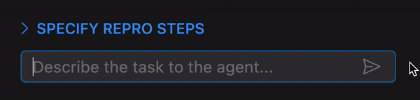
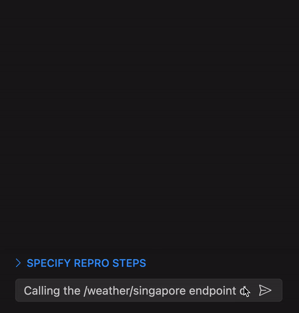
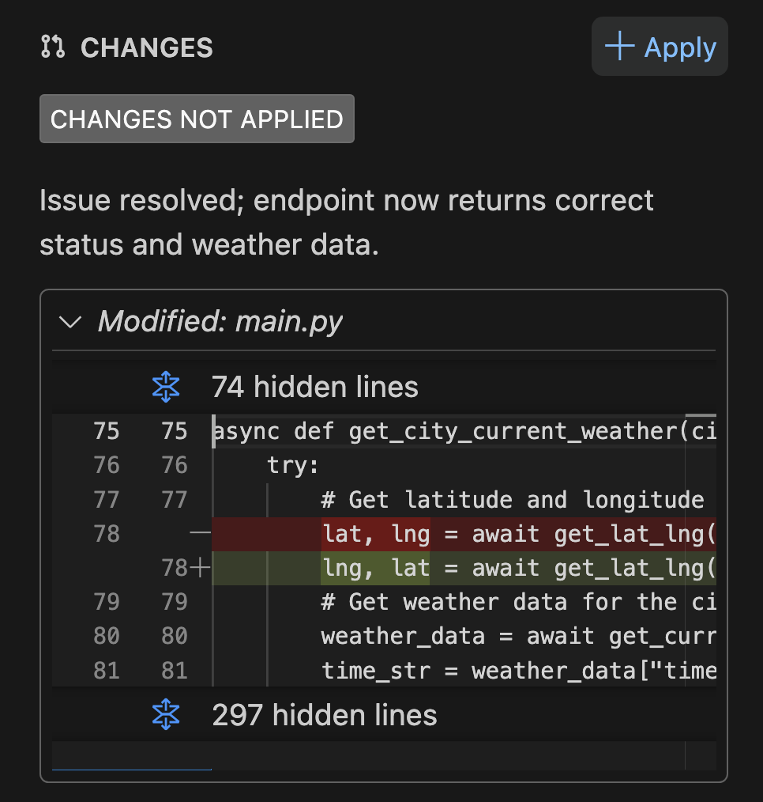

<h1 align="center">Trace: An open-source AI debugging agent for VSCode</h1>

Trace is an open-source AI debugging agent for VSCode that uses LLMs to help identify and fix backend code errors (inspired by [SWE-agent](https://swe-agent.com)).

Trace leverages the VSCode API, Language Server Protocol (LSP), and print statement debugging to triangulate and address [bugs in real-world backend systems](https://github.com/calcom/cal.com/issues/9243).

## Get Started

> Note: You will be prompted to provide your OpenAI API key for your first run. This key is stored locally in your VSCode config for subsequent calls to OpenAI's server.

1. Install the [trace VSCode extension](https://marketplace.visualstudio.com/items?itemName=trace.trace) from the VSCode extension marketplace.
2. Go to the chat interface by clicking on the ghost icon on the side bar.
3. Describe the bug you are trying to fix in the chatbox.\
   
4. Specify the repro steps to trigger the bug. (Optional but recommended because it will give the agent access to runtime for debugging).\
   
5. Ensure there are no other terminal processes that might have a port conflict with your build and test command.
6. Start the agent and watch it go brrrr... 💨

You can always provide feedback while the agent is running. The feedback will be incorporated by the agent in the subsequent step.

Once the agent is done, you will be presented with the UI to accept or reject the changes that the agent has made.\

If you found trace helpful, please give our repo a star ⭐ to show your support!

## Roadmap

- Automating repro step creation and making it more seamless.
  - Problem: Creating repros is tedious and time-consuming, increases friction to use the agent.
  - Ideas:
    - Use demonstration data to show how to create a repro.
    - Have the LLM collaborate with user to generate a repro script. This could be tied into the repository's testing framework.
    - Re-design the repro to fit better into a developer's workflow.
- Supporting more models (e.g. LLaMA 3, Claude).
- Better agent history filtering and backtracking.
  - Problem: As the agent progress, the prompt gets too long. This slows LLM inference and increases the chance that trace gets confused.
  - Ideas:
    - More robust technique to prune already explored paths.
    - Summarize chunks of history into relevant points.
- Improved context discovery with embeddings.
- Stateful representation of file content
- Add proper unit and e2e testing

## FAQ

### How is trace related to SWE-agent?

We were heavily inspired by and borrowed from the great work done by the folks behind SWE-Agent - our core agent loop was ported over from them.

We extended their core insight around building good agent-computer interfaces by giving it additional navigation tools such as `GoToDefinition` and `GetAllReferences` using VSCode's Language Server Protocol (LSP) to efficiently traverse the codebase. We also added `GetFilesRelevantToEndpoint` to better navigate backend system.

Second, we thought it would be cool to have SWE-agent embedded within VSCode so devs can use it during development and provide feedback to it midway using the VSCode extension UI

We also experimented with using a "match and replace" technique to edit files instead of using start line numbers, end line numbers and new text. The folks at [aider.chat](https://aider.chat/docs/unified-diffs.html) do something similar as well.

### Why do you need "match and replace" editing and how does it work?

As of May 2024, SOTA LLMs struggle with making big edits, causing the agent to waste multiple iterations just to make the correct edit.

Our "match and replace" technique forces the agent to generate the original text prepended with line numbers. The redundancy of line numbers and text content helps to catch hallucination and bad indentation errors. By generating the original text, it seems to also helps with generating a correctly indented replacement text.

### What is the purpose of `Verify`?

`Verify` is a tool that allows the agent to run the repro steps specified by the user. The agent will need to debug the code iteratively until the test in repro step passes. `Verify` also allows the agent to utilize the execution feedback of its print statements.

`Verify` is similar to the `reproduce.py` that SWE-agent creates to reproduce the error.

### Why does `Verify` take so long to run?

Always inspect the output of `Verify` to see if there are any obvious issues. Here are some common issues:

1. The build / run process is already running in the terminal, causing a conflict in the port. The fix is to kill the process running in your local terminal.
2. `Verify` needs to wait for the build / run step to complete before running the test step. A build step is complete if it either exits OR the the log matches any of these patterns in [src/tools/verifier.ts](/src/tools/verifier.ts#L151).\
   If your build step's log does not match any of these, you can configure your own by clicking "Advanced Settings" under "Specify Repro Steps" and fill in the "Build Ready Text" section.
3. The build process takes a long time to complete. This is an unavoidable problem with no easy solution.

### How do I customize the prompts?

Since this repo is open-source, you can edit the prompts in [src/config/default.yaml](src/config/default.yaml) and rebuild the extension. Currently, there is no easy way to edit the prompt as an end user without rebuilding. If there is sufficient interest, we can add it to the roadmap.

### Why is trace designed for backend systems?

trace is focused on backend systems as we want to optimize the UX for a specific development stack. Backend bugs also tend to be easier to reproduce programatically and can be readily expressed as text, making it easier to feed into most LLMs.

Eventually, our plan is to expand beyond backend systems into other development stacks.
